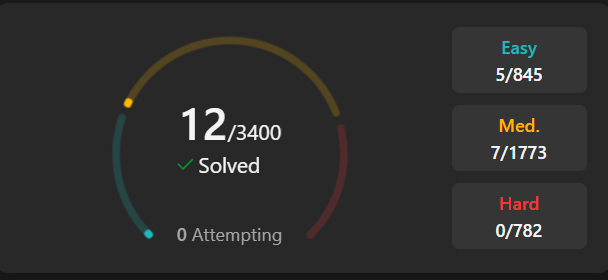

## Leetcode



### 27. Remove Element

Given an integer array nums and an integer val, remove all occurrences of val in nums in-place. The order of the elements may be changed. Then return the number of elements in nums which are not equal to val.

Consider the number of elements in nums which are not equal to val be k, to get accepted, you need to do the following things:

Change the array nums such that the first k elements of nums contain the elements which are not equal to val. The remaining elements of nums are not important as well as the size of nums.
Return k.
Custom Judge:

The judge will test your solution with the following code:

int[] nums = [...]; // Input array
int val = ...; // Value to remove
int[] expectedNums = [...]; // The expected answer with correct length.
                            // It is sorted with no values equaling val.

int k = removeElement(nums, val); // Calls your implementation

assert k == expectedNums.length;
sort(nums, 0, k); // Sort the first k elements of nums
for (int i = 0; i < actualLength; i++) {
    assert nums[i] == expectedNums[i];
}
If all assertions pass, then your solution will be accepted.

 

Example 1:

Input: nums = [3,2,2,3], val = 3
Output: 2, nums = [2,2,_,_]
Explanation: Your function should return k = 2, with the first two elements of nums being 2.
It does not matter what you leave beyond the returned k (hence they are underscores).
Example 2:

Input: nums = [0,1,2,2,3,0,4,2], val = 2
Output: 5, nums = [0,1,4,0,3,_,_,_]
Explanation: Your function should return k = 5, with the first five elements of nums containing 0, 0, 1, 3, and 4.
Note that the five elements can be returned in any order.
It does not matter what you leave beyond the returned k (hence they are underscores).
 

Constraints:

0 <= nums.length <= 100
0 <= nums[i] <= 50
0 <= val <= 100
 

### Solution
```python
class Solution:
    def removeElement(self, nums: List[int], val: int) -> int:
        count = 0
        for i in range(len(nums))[::-1]:
            if nums[i] == val:
                nums.pop(i)
                nums.append('_')
                count += 1
        return len(nums)-count        
        
```
### 88. Merge Sorted Array

You are given two integer arrays nums1 and nums2, sorted in non-decreasing order, and two integers m and n, representing the number of elements in nums1 and nums2 respectively.

Merge nums1 and nums2 into a single array sorted in non-decreasing order.

The final sorted array should not be returned by the function, but instead be stored inside the array nums1. To accommodate this, nums1 has a length of m + n, where the first m elements denote the elements that should be merged, and the last n elements are set to 0 and should be ignored. nums2 has a length of n.

 

Example 1:

Input: nums1 = [1,2,3,0,0,0], m = 3, nums2 = [2,5,6], n = 3
Output: [1,2,2,3,5,6]
Explanation: The arrays we are merging are [1,2,3] and [2,5,6].
The result of the merge is [1,2,2,3,5,6] with the underlined elements coming from nums1.
Example 2:

Input: nums1 = [1], m = 1, nums2 = [], n = 0
Output: [1]
Explanation: The arrays we are merging are [1] and [].
The result of the merge is [1].
Example 3:

Input: nums1 = [0], m = 0, nums2 = [1], n = 1
Output: [1]
Explanation: The arrays we are merging are [] and [1].
The result of the merge is [1].
Note that because m = 0, there are no elements in nums1. The 0 is only there to ensure the merge result can fit in nums1.
 

Constraints:

nums1.length == m + n
nums2.length == n
0 <= m, n <= 200
1 <= m + n <= 200
-109 <= nums1[i], nums2[j] <= 109
 

### Solution
```python
class Solution:
    def merge(self, nums1: List[int], m: int, nums2: List[int], n: int) -> None:
        """
        Do not return anything, modify nums1 in-place instead.
        """
        del nums1[m:m+n]
        for i in range(n):
            k=0
            while k in range (len(nums1)) and nums1[k] < nums2[i]:
                k+=1
            nums1.insert(k, nums2[i])
        
```

### 238. Product of Array Except Self

Given an integer array nums, return an array answer such that answer[i] is equal to the product of all the elements of nums except nums[i].

The product of any prefix or suffix of nums is guaranteed to fit in a 32-bit integer.

You must write an algorithm that runs in O(n) time and without using the division operation.

 

Example 1:

Input: nums = [1,2,3,4]
Output: [24,12,8,6]

Example 2:

Input: nums = [-1,1,0,-3,3]
Output: [0,0,9,0,0]
 

Constraints:

2 <= nums.length <= 105
-30 <= nums[i] <= 30
The product of any prefix or suffix of nums is guaranteed to fit in a 32-bit integer.
 

### Solution
```python
class Solution:
    def productExceptSelf(self, nums: List[int]) -> List[int]:
        n = len(nums)
        answer = [1] * n
        
        left_product = 1
        for i in range(n):
            answer[i] = left_product
            left_product *= nums[i]
        
        right_product = 1
        for i in range(n - 1, -1, -1):
            answer[i] *= right_product
            right_product *= nums[i]
        
        return answer
```

### 238. Product of Array Except Self

Given an integer array nums, return an array answer such that answer[i] is equal to the product of all the elements of nums except nums[i].

The product of any prefix or suffix of nums is guaranteed to fit in a 32-bit integer.

You must write an algorithm that runs in O(n) time and without using the division operation.

 

Example 1:

Input: nums = [1,2,3,4]
Output: [24,12,8,6]

Example 2:

Input: nums = [-1,1,0,-3,3]
Output: [0,0,9,0,0]
 

Constraints:

2 <= nums.length <= 105
-30 <= nums[i] <= 30
The product of any prefix or suffix of nums is guaranteed to fit in a 32-bit integer.
 

### Solution
```python
class RandomizedSet:
    def __init__(self):
        self.val_to_index = {}
        self.values = []

    def insert(self, val: int) -> bool:
        if val in self.val_to_index:
            return False
        self.val_to_index[val] = len(self.values)
        self.values.append(val)
        return True

    def remove(self, val: int) -> bool:
        if val not in self.val_to_index:
            return False
        index = self.val_to_index[val]
        last_val = self.values[-1]
        self.values[index] = last_val
        self.val_to_index[last_val] = index
        self.values.pop()
        del self.val_to_index[val]
        return True

    def getRandom(self) -> int:
        return random.choice(self.values)
```

### 274. H-Index


Given an array of integers citations where citations[i] is the number of citations a researcher received for their ith paper, return the researcher's h-index.

According to the definition of h-index on Wikipedia: The h-index is defined as the maximum value of h such that the given researcher has published at least h papers that have each been cited at least h times.

 

Example 1:

Input: citations = [3,0,6,1,5]
Output: 3
Explanation: [3,0,6,1,5] means the researcher has 5 papers in total and each of them had received 3, 0, 6, 1, 5 citations respectively.
Since the researcher has 3 papers with at least 3 citations each and the remaining two with no more than 3 citations each, their h-index is 3.
Example 2:

Input: citations = [1,3,1]
Output: 1
 

### Solution
```python
class Solution:
    def hIndex(self, citations: List[int]) -> int:
        citations.sort(reverse=True)  
        h_index = 0
        for i, citation in enumerate(citations):
            if citation >= i + 1:
                h_index = i + 1
            else:
                break
        return h_index
```

### 55. Jump Game

You are given an integer array nums. You are initially positioned at the array's first index, and each element in the array represents your maximum jump length at that position.

Return true if you can reach the last index, or false otherwise.

 

Example 1:

Input: nums = [2,3,1,1,4]
Output: true
Explanation: Jump 1 step from index 0 to 1, then 3 steps to the last index.
Example 2:

Input: nums = [3,2,1,0,4]
Output: false
Explanation: You will always arrive at index 3 no matter what. Its maximum jump length is 0, which makes it impossible to reach the last index.
 

Constraints:

1 <= nums.length <= 104
0 <= nums[i] <= 105
 

### Solution
```python
class Solution:
    def canJump(self, nums: List[int]) -> bool:
        max_reach = 0
        for i, jump in enumerate(nums):
            if i > max_reach:
                return False
            max_reach = max(max_reach, i + jump)
            if max_reach >= len(nums) - 1:
                return True
        return False
```

### 122. Best Time to Buy and Sell Stock II


You are given an integer array prices where prices[i] is the price of a given stock on the ith day.

On each day, you may decide to buy and/or sell the stock. You can only hold at most one share of the stock at any time. However, you can buy it then immediately sell it on the same day.

Find and return the maximum profit you can achieve.

 

Example 1:

Input: prices = [7,1,5,3,6,4]
Output: 7
Explanation: Buy on day 2 (price = 1) and sell on day 3 (price = 5), profit = 5-1 = 4.
Then buy on day 4 (price = 3) and sell on day 5 (price = 6), profit = 6-3 = 3.
Total profit is 4 + 3 = 7.
Example 2:

Input: prices = [1,2,3,4,5]
Output: 4
Explanation: Buy on day 1 (price = 1) and sell on day 5 (price = 5), profit = 5-1 = 4.
Total profit is 4.
Example 3:

Input: prices = [7,6,4,3,1]
Output: 0
Explanation: There is no way to make a positive profit, so we never buy the stock to achieve the maximum profit of 0.
 

Constraints:

1 <= prices.length <= 3 * 104
0 <= prices[i] <= 104
 

### Solution
```python
class Solution:
    def maxProfit(self, prices: List[int]) -> int:
        max_profit = 0
        for i in range(1, len(prices)):
            if prices[i] > prices[i - 1]:
                max_profit += prices[i] - prices[i - 1]
        return max_profit
```

