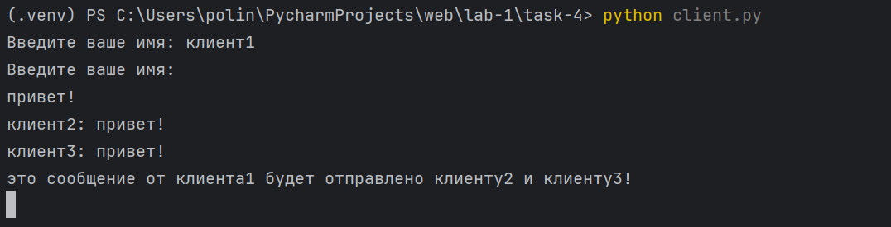
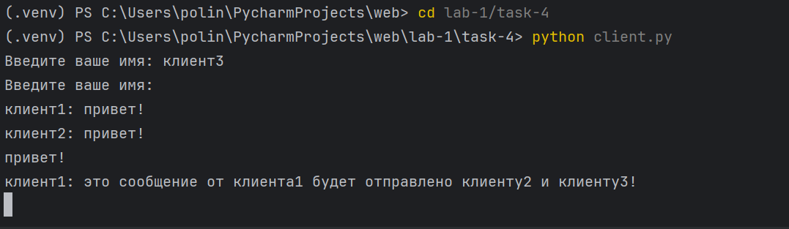

# Задание 4

Реализовать двухпользовательский или многопользовательский чат. Для максимального количества баллов реализуйте многопользовательский чат.

Требования:

Обязательно использовать библиотеку socket.

Для многопользовательского чата необходимо использовать библиотеку threading.


**код из файла client.py:**
```python
import socket
import threading


def receive_messages(client_socket):
    """Функция для получения сообщений от сервера."""
    while True:
        try:
            message = client_socket.recv(1024).decode()
            if message:
                print(message)
        except:
            break


def start_client():
    """Запуск клиента и подключение к серверу."""
    client_socket = socket.socket(socket.AF_INET, socket.SOCK_STREAM)
    client_socket.connect(("127.0.0.1", 8080))

    name = input("Введите ваше имя: ")
    client_socket.send(name.encode())

    # Запускаем поток для получения сообщений от других клиентов
    receive_thread = threading.Thread(target=receive_messages, args=(client_socket,))
    receive_thread.start()

    # Отправляем сообщения на сервер
    while True:
        message = input()
        if message.lower() == 'exit':
            break
        client_socket.send(message.encode())

    client_socket.close()


if __name__ == "__main__":
    start_client()

```

**код из файла server.py:**


```python
import socket
import threading

clients = []
client_names = {}


def handle_client(client_socket, client_address):
    """Функция обработки сообщений от клиента."""
    try:
        client_socket.send("Введите ваше имя: ".encode())
        name = client_socket.recv(1024).decode().strip()
        client_names[client_socket] = name
        clients.append(client_socket)

        print(f"{name} подключился из {client_address}")

        # Обрабатываем сообщения от клиента
        while True:
            message = client_socket.recv(1024).decode()
            if message:
                print(f"Получено сообщение от {name}: {message}")
                broadcast(f"{name}: {message}", client_socket)
            else:
                break
    except:
        print(f"Ошибка с клиентом {client_address}")
    finally:
        clients.remove(client_socket)
        del client_names[client_socket]
        client_socket.close()


def broadcast(message, sender_socket):
    """Отправляем сообщение всем подключенным клиентам, кроме отправителя."""
    for client_socket in clients:
        if client_socket != sender_socket:
            try:
                client_socket.send(message.encode())
            except:
                clients.remove(client_socket)


def start_server():
    server_socket = socket.socket(socket.AF_INET, socket.SOCK_STREAM)
    server_socket.bind(("127.0.0.1", 8080))
    server_socket.listen(5)
    print("Сервер запущен. Ожидаю подключения...")

    while True:
        client_socket, client_address = server_socket.accept()
        # Запускаем новый поток для каждого клиента
        client_thread = threading.Thread(target=handle_client, args=(client_socket, client_address))
        client_thread.start()


if __name__ == "__main__":
    start_server()

```
**Работа первого клиента при запуске кода на скриншоте**


**Работа третьего клиента при запуске кода на скриншоте**


