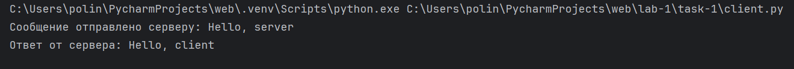
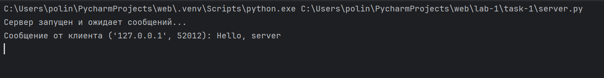

# Задание 1

Реализовать клиентскую и серверную часть приложения. Клиент отправляет серверу сообщение «Hello, server», и оно должно отобразиться на стороне сервера. В ответ сервер отправляет клиенту сообщение «Hello, client», которое должно отобразиться у клиента.

Требования:

Обязательно использовать библиотеку socket.
Реализовать с помощью протокола UDP.

**код из файла client.py:**
```python
import socket


def start_client():
    server_address = ("127.0.0.1", 12345)

    with socket.socket(socket.AF_INET, socket.SOCK_DGRAM) as client_socket:
        message = "Hello, server"
        client_socket.sendto(message.encode(), server_address)
        print(f"Сообщение отправлено серверу: {message}")

        data, _ = client_socket.recvfrom(1024)
        print(f"Ответ от сервера: {data.decode()}")


if __name__ == "__main__":
    start_client()
```

**код из файла server.py:**
```python
import socket


def start_server():
    server_address = ("127.0.0.1", 12345)

    with socket.socket(socket.AF_INET, socket.SOCK_DGRAM) as server_socket:
        server_socket.bind(server_address)
        print("Сервер запущен и ожидает сообщений...")

        while True:
            data, client_address = server_socket.recvfrom(1024)
            print(f"Сообщение от клиента {client_address}: {data.decode()}")

            response = "Hello, client"
            server_socket.sendto(response.encode(), client_address)


if __name__ == "__main__":
    start_server()
```


