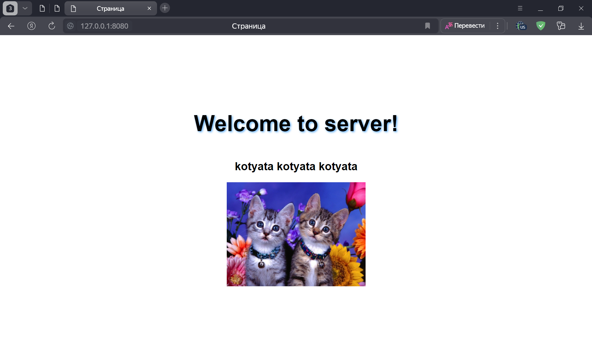

# Задание 3

Реализовать серверную часть приложения. Клиент подключается к серверу, и в ответ получает HTTP-сообщение, содержащее HTML-страницу, которая сервер подгружает из файла index.html.

Требования:

Обязательно использовать библиотеку socket.

**код из файла server.py:**
```python
import socket
import os


def start_server():
    server_address = ("127.0.0.1", 8080)

    with socket.socket(socket.AF_INET, socket.SOCK_STREAM) as server_socket:
        server_socket.bind(server_address)
        server_socket.listen(1)
        print("Сервер запущен и ожидает подключений на порту 8080...")

        while True:
            connection, client_address = server_socket.accept()
            with connection:
                print(f"Подключен клиент: {client_address}")
                request = connection.recv(1024).decode()

                if not request.strip():
                    print("Пустой запрос. Пропускаем...")
                    continue

                print(f"Получен запрос: {request.splitlines()[0]}")

                try:
                    resource = request.split(" ")[1]
                except IndexError:
                    resource = "/"

                if resource == "/" or resource == "/index.html":
                    # Загрузка HTML-страницы
                    try:
                        with open("index.html", "r", encoding="utf-8") as file:
                            html_content = file.read()
                        response_body = html_content
                        response_headers = (
                            "HTTP/1.1 200 OK\r\n"
                            "Content-Type: text/html; charset=utf-8\r\n"
                            f"Content-Length: {len(response_body)}\r\n"
                            "Connection: close\r\n\r\n"
                        )
                    except FileNotFoundError:
                        response_body = "<h1>404 Not Found</h1>"
                        response_headers = (
                            "HTTP/1.1 404 Not Found\r\n"
                            "Content-Type: text/html; charset=utf-8\r\n"
                            f"Content-Length: {len(response_body)}\r\n"
                            "Connection: close\r\n\r\n"
                        )
                elif resource.startswith("/images/"):
                    # Обработка запроса на изображение
                    image_path = resource.lstrip("/")
                    if os.path.exists(image_path):
                        with open(image_path, "rb") as file:
                            image_content = file.read()
                        response_body = image_content
                        response_headers = (
                                               "HTTP/1.1 200 OK\r\n"
                                               "Content-Type: image/png\r\n"
                                               f"Content-Length: {len(response_body)}\r\n"
                                               "Connection: close\r\n\r\n"
                                           ).encode() + response_body
                        connection.sendall(response_headers)
                        continue
                    else:
                        response_body = "<h1>404 Not Found</h1>"
                        response_headers = (
                            "HTTP/1.1 404 Not Found\r\n"
                            "Content-Type: text/html; charset=utf-8\r\n"
                            f"Content-Length: {len(response_body)}\r\n"
                            "Connection: close\r\n\r\n"
                        )
                else:
                    # Если ресурс не найден
                    response_body = "<h1>404 Not Found</h1>"
                    response_headers = (
                        "HTTP/1.1 404 Not Found\r\n"
                        "Content-Type: text/html; charset=utf-8\r\n"
                        f"Content-Length: {len(response_body)}\r\n"
                        "Connection: close\r\n\r\n"
                    )

                # Отправка HTTP-ответа клиенту
                response = response_headers + response_body
                connection.sendall(response.encode() if isinstance(response, str) else response)


if __name__ == "__main__":
    start_server()

```
Код из файла index.html

```html
<!DOCTYPE html>
<html lang="en">
<head>
    <meta charset="UTF-8">
    <meta name="viewport" content="width=device-width, initial-scale=1.0">
    <title>Страница</title>
    <style>
        body {
            margin: 0;
            padding: 0;
            font-family: "Roboto Light", sans-serif;
            display: flex;
            justify-content: center;
            align-items: center;
            height: 100vh;
            color: black;
            text-align: center;
            flex-direction: column;
        }

        h1 {
            font-size: 3em;
            text-shadow: 2px 2px 4px rgb(104, 181, 255);
        }
    </style>
</head>
<body>
<h1>Welcome to server!</h1>
<h2>kotyata kotyata kotyata</h2>

</body>
</html>
```

После запуска сервера переходим на http://localhost:8080

**Работа сервера на localhost при запуске кода на скриншоте**


