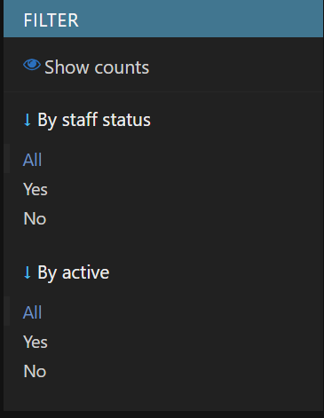
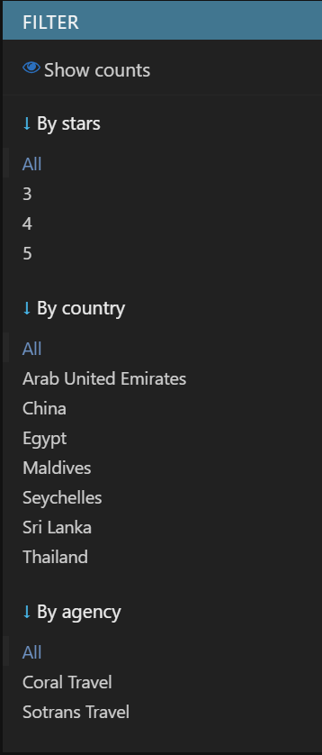
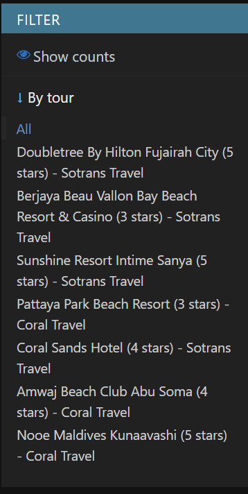
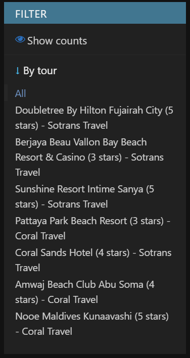
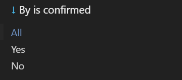
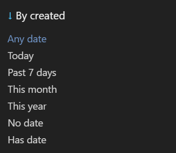
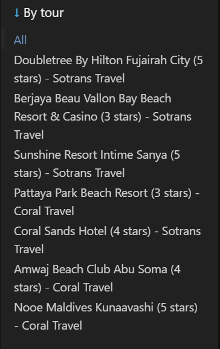
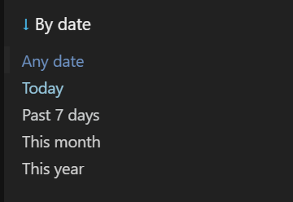
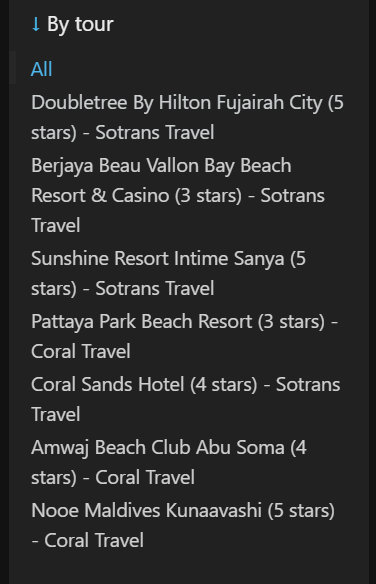

# Админ панель


## CustomUser

- Возможность фильтрации пользователей по статусу активности и правам администратора.
- Реализован поиск по имени пользователя и электронной почте для быстрой навигации.

```python
@admin.register(CustomUser)
class CustomUserAdmin(admin.ModelAdmin):
    list_display = ('username', 'email', 'is_staff', 'is_active')
    list_filter = ('is_staff', 'is_active')
    search_fields = ('username', 'email')
```



## TravelAgency

- Фильтрация по названию агентства.
- Возможность быстрого поиска по названию агентства.

```python
@admin.register(TravelAgency)
class TravelAgencyAdmin(admin.ModelAdmin):
    list_display = ('name', 'contact_info')
    search_fields = ('name',)
    ordering = ('name',)
```

## Tour

- Фильтрация туров по количеству звезд, стране и агентству.
- Поиск по названию отеля, городу и стране для удобства навигации.
- Сортировка туров по дате начала.

```python
@admin.register(Tour)
class TourAdmin(admin.ModelAdmin):
    list_display = ('hotel', 'stars', 'agency', 'country', 'city', 'start_date', 'end_date')
    list_filter = ('stars', 'country', 'agency')
    search_fields = ('hotel', 'country', 'city')
    ordering = ('start_date',)

```


## Tariff

- Добавлена фильтрация по туру.
- Реализован поиск по названию тарифа.
- Сортировка тарифов по цене.

```python
@admin.register(Tariff)
class TariffAdmin(admin.ModelAdmin):
    list_display = ('name', 'price', 'tour')
    list_filter = ('tour',)
    search_fields = ('name',)
    ordering = ('price',)
```


## MealOption

- Фильтрация вариантов питания по туру.
- Возможность поиска по названию варианта питания.
- Сортировка по цене.

```python
@admin.register(MealOption)
class MealOptionAdmin(admin.ModelAdmin):
    list_display = ('name', 'price', 'tour')
    list_filter = ('tour',)
    search_fields = ('name',)
    ordering = ('price',)
```



## Booking

- Фильтрация бронирований по статусу подтверждения, дате создания и туру.
- Поиск по имени пользователя и названию отеля.
- Сортировка бронирований по дате создания (от новых к старым).

```python
@admin.register(Booking)
class BookingAdmin(admin.ModelAdmin):
    list_display = ('user', 'tour', 'num_people', 'tariff', 'meal_option', 'is_confirmed', 'total_price', 'created')
    list_filter = ('is_confirmed', 'created', 'tour')
    search_fields = ('user__username', 'tour__hotel')
    ordering = ('-created',)
```





## Review

- Фильтрация отзывов по рейтингу, дате создания и туру.
- Поиск по имени пользователя, названию отеля и тексту отзыва.
- Сортировка отзывов по дате (от новых к старым).


```python
@admin.register(Review)
class ReviewAdmin(admin.ModelAdmin):
    list_display = ('user', 'tour', 'rating', 'date', 'text')
    list_filter = ('rating', 'date', 'tour')
    search_fields = ('user__username', 'tour__hotel', 'text')
    ordering = ('-date',)
```




