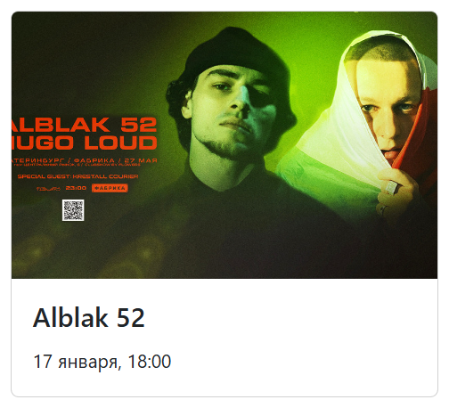
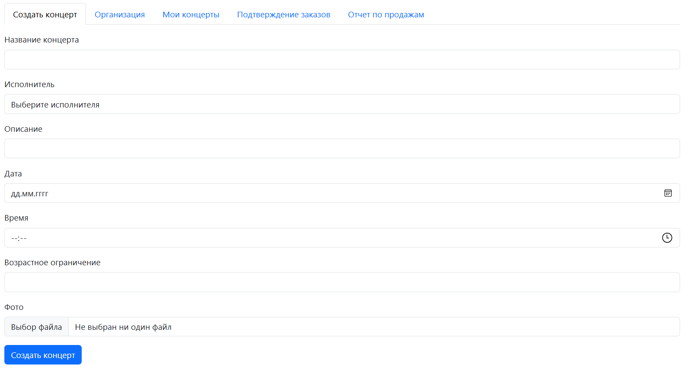
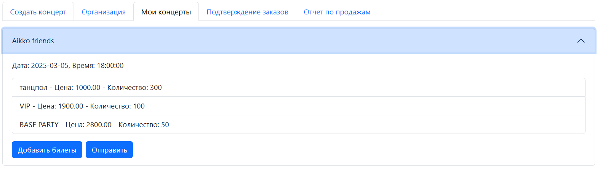
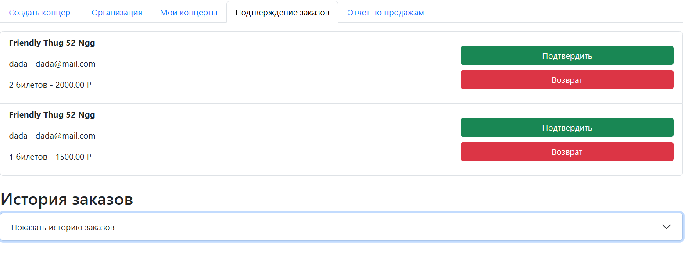
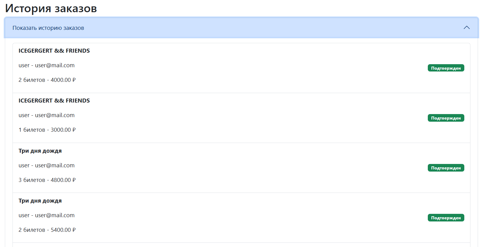
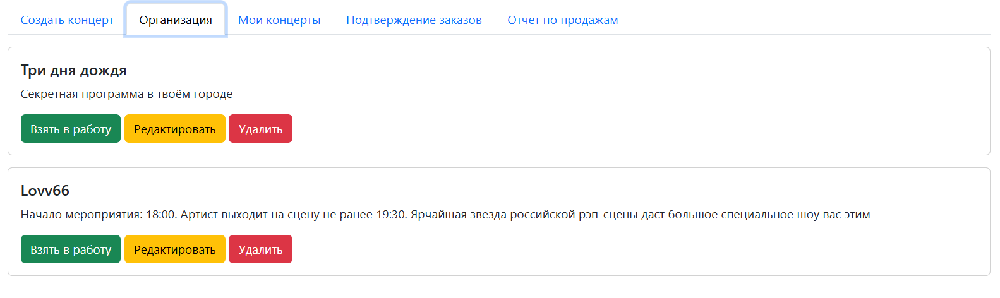
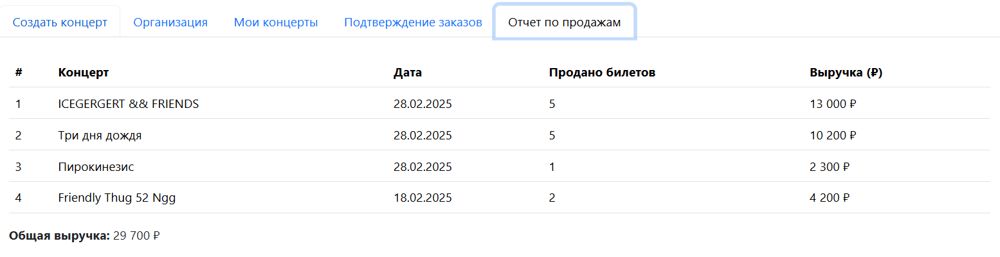

# Компоненты


## Карточка концерта

```js
import { formatInTimeZone } from 'date-fns-tz';
import { ru } from 'date-fns/locale';

const ConcertCard = ({ concert }) => {
  const { title, date, time, image, id } = concert;

  const timeZone = 'Europe/Moscow';

  const dateObj = new Date(date);
  const timeObj = new Date(`${date}T${time}`);

  const formattedDate = formatInTimeZone(dateObj, timeZone, "d MMMM", { locale: ru });
  const formattedTime = formatInTimeZone(timeObj, timeZone, "HH:mm", { locale: ru });

  return (
    <a href={`/concerts/${id}`} className="card mb-4 text-decoration-none" style={{ width: '20rem', cursor: 'pointer', color: 'inherit' }}>
      
      <div className="card-body">
        <h5 className="card-title">{title}</h5>
        <p className="card-text"><small>{formattedDate}, {formattedTime}</small></p>
      </div>
    </a>
  );
};

export default ConcertCard;

```




## Хедер

```js
import React, { useContext } from "react";
import { Link, useNavigate } from "react-router-dom";
import { AuthContext } from "../utils/AuthContext";

const Header = () => {
  const { userRole, isAuthenticated, logout } = useContext(AuthContext);
  const navigate = useNavigate();

  const handleLogout = () => {
    logout();
    navigate("/login");
  };

  return (
    <nav className="navbar navbar-dark bg-dark p-3">
      <div className="container d-flex justify-content-between">
        <Link className="navbar-brand" to="/">Concert Hall</Link>

        {isAuthenticated ? (
          <div>
            {userRole === "user" ? (
              <Link className="btn btn-outline-light me-2" to="/orders/my">Мои заказы</Link>
            ) : (
              <Link className="btn btn-outline-light me-2" to="/admin">Админ-панель</Link>
            )}
            <button className="btn btn-danger" onClick={handleLogout}>Выйти</button>
          </div>
        ) : (
          <Link className="btn btn-outline-light" to="/login">Войти</Link>
        )}
      </div>
    </nav>
  );
};

export default Header;
```


## Футер

```js
import React from 'react';

const Footer = () => (
  <footer className="bg-dark text-white text-center p-3 mt-4">
    <p>&copy; 2025 Concert Hall. Все права защищены.</p>
  </footer>
);

export default Footer;
```


## Создание концерта

```js
import React, { useState, useEffect } from 'react';
import { Form, Button } from 'react-bootstrap';
import axios from 'axios';

const CreateConcert = () => {
  const [concertDetails, setConcertDetails] = useState({
    title: '',
    performer: '',
    description: '',
    date: '',
    time: '',
    age_limit: '',
    image: null, // Добавлено для фото
  });

  const [performers, setPerformers] = useState([]);

  const token = localStorage.getItem('token');

  useEffect(() => {
    axios.get('http://localhost:8000/performers/', {
      headers: token ? { Authorization: `Token ${token}` } : {},
    })
      .then((response) => {
        setPerformers(response.data);
      })
      .catch((error) => {
        console.error('Ошибка при получении списка исполнителей', error);
      });
  }, []);

  const handleChange = (e) => {
    const { name, value } = e.target;
    setConcertDetails((prev) => ({ ...prev, [name]: value }));
  };

  const handleFileChange = (e) => {
    const file = e.target.files[0];
    setConcertDetails((prev) => ({ ...prev, image: file }));
  };

  const handleSubmit = (e) => {
    e.preventDefault();

    const formData = new FormData();
    formData.append('title', concertDetails.title);
    formData.append('performer', concertDetails.performer);
    formData.append('description', concertDetails.description);
    formData.append('date', concertDetails.date);
    formData.append('time', concertDetails.time);
    formData.append('age_limit', concertDetails.age_limit);
    if (concertDetails.image) {
      formData.append('image', concertDetails.image);
    }

    axios.post('http://localhost:8000/concerts/create/', formData, {
      headers: {
        Authorization: `Token ${token}`,
        'Content-Type': 'multipart/form-data',
      },
    })
      .then((response) => {
        console.log('Концерт создан', response.data);
      })
      .catch((error) => {
        console.error('Ошибка при создании концерта', error);
      });
  };

  return (
    <div>
      <Form onSubmit={handleSubmit} className="mt-3">
        <Form.Group>
          <Form.Label>Название концерта</Form.Label>
          <Form.Control
            type="text"
            name="title"
            value={concertDetails.title}
            onChange={handleChange}
          />
        </Form.Group>

        {/* Выпадающий список для исполнителей */}
        <Form.Group>
          <Form.Label className="mt-3">Исполнитель</Form.Label>
          <Form.Control
            as="select"
            name="performer"
            value={concertDetails.performer}
            onChange={handleChange}
          >
            <option value="">Выберите исполнителя</option>
            {performers.map((performer) => (
              <option key={performer.id} value={performer.id}>
                {performer.name}
              </option>
            ))}
          </Form.Control>
        </Form.Group>

        <Form.Group>
          <Form.Label className="mt-3">Описание</Form.Label>
          <Form.Control
            type="text"
            name="description"
            value={concertDetails.description}
            onChange={handleChange}
          />
        </Form.Group>
        <Form.Group>
          <Form.Label className="mt-3">Дата</Form.Label>
          <Form.Control
            type="date"
            name="date"
            value={concertDetails.date}
            onChange={handleChange}
          />
        </Form.Group>
        <Form.Group className="mt-3">
          <Form.Label>Время</Form.Label>
          <Form.Control
            type="time"
            name="time"
            value={concertDetails.time}
            onChange={handleChange}
          />
        </Form.Group>
        <Form.Group className="mt-3">
          <Form.Label>Возрастное ограничение</Form.Label>
          <Form.Control
            type="text"
            name="age_limit"
            value={concertDetails.age_limit}
            onChange={handleChange}
          />
        </Form.Group>

        {/* Поле для загрузки фото */}
        <Form.Group className="mt-3">
          <Form.Label>Фото</Form.Label>
          <Form.Control
            type="file"
            onChange={handleFileChange}
          />
        </Form.Group>

      <Button type="submit" className="mt-3">Создать концерт</Button>
      </Form>
    </div>
  );
};

export default CreateConcert;

```



## Концерты организатора

```js
import React, { useState, useEffect } from 'react';
import { Button, Accordion, ListGroup, Form, Modal } from 'react-bootstrap';
import axios from 'axios';

const MyConcerts = () => {
  const [concerts, setConcerts] = useState([]);
  const [selectedConcert, setSelectedConcert] = useState(null);
  const [ticketName, setTicketName] = useState('');
  const [ticketPrice, setTicketPrice] = useState('');
  const [ticketCount, setTicketCount] = useState(1);
  const [showModal, setShowModal] = useState(false);
  const [currentConcertId, setCurrentConcertId] = useState(null);
  const token = localStorage.getItem('token');

  useEffect(() => {
    axios.get('http://localhost:8000/organizer/concerts/', {
      headers: { Authorization: `Token ${token}` },
    })
      .then((response) => setConcerts(response.data))
      .catch((error) => console.error('Ошибка загрузки концертов:', error));
  }, [token]);

  const handleAddTickets = () => {
    if (!ticketName || !ticketPrice || ticketCount <= 0) {
      alert("Пожалуйста, укажите название, цену и количество билетов больше 0.");
      return;
    }


    axios.post(`http://localhost:8000/concerts/tickets/`, {
      concert: currentConcertId,
      name: ticketName,
      price: ticketPrice,
      total_quantity: ticketCount
    }, {
      headers: { Authorization: `Token ${token}` }
    })
    .then(() => {
      alert('Билеты добавлены');
      setTicketName('');
      setTicketPrice('');
      setTicketCount(1);
      setShowModal(false);

      axios.get(`http://localhost:8000/concerts/${currentConcertId}/`, {
        headers: { Authorization: `Token ${token}` },
      })
      .then((response) => {
        setConcerts((prevConcerts) => prevConcerts.map((concert) => {
          if (concert.id === currentConcertId) {
            return { ...concert, tickets: response.data.tickets };
          }
          return concert;
        }));

      })
      .catch((error) => alert('Ошибка обновления билетов: ' + error.response.data));
    })
    .catch((error) => alert('Ошибка добавления билетов: ' + error.response.data));
  };

  const handleConcertClick = (concertId) => {
    if (selectedConcert === concertId) {
      setSelectedConcert(null);
      setTicketName('');
      setTicketPrice('');
      setTicketCount(1);
    } else {
      setSelectedConcert(concertId);
    }
  };

  const handleSendStatusUpdate = (concertId) => {
    axios.post(`http://localhost:8000/concerts/${concertId}/status/`, {}, {
      headers: { Authorization: `Token ${token}` }
    })
    .then(() => {
      alert('Статус концерта изменен на "Подготовлен"');
      setConcerts((prevConcerts) =>
        prevConcerts.map((concert) =>
          concert.id === concertId ? { ...concert, status: 'Подготовлен' } : concert
        )
      );
    })
    .catch((error) => alert('Ошибка при изменении статуса: ' + error.response.data));
  };

  return (
    <div>
      {concerts.length === 0 && <p className="mt-3">Нет доступных концертов</p>}
      <Accordion className="mt-3">
        {concerts.map((concert) => (
          <Accordion.Item key={concert.id} eventKey={concert.id.toString()}>
            <Accordion.Header>{concert.title}</Accordion.Header>
            <Accordion.Body>
              <p>Дата: {concert.date}, Время: {concert.time}</p>

              {/* Отображение билетов для концерта */}
              <ListGroup className="mt-2">
                {concert.tickets && concert.tickets.map((ticket) => (
                  <ListGroup.Item key={ticket.id}>
                    {ticket.name} - Цена: {ticket.price} - Количество: {ticket.total_quantity}
                  </ListGroup.Item>
                ))}
              </ListGroup>

                <div className="d-flex gap-2 mt-3">
                  <div className="d-flex gap-2">
                    <Button onClick={() => {
                      setCurrentConcertId(concert.id);
                      setShowModal(true);
                    }}>Добавить билеты</Button>
                    <Button onClick={() => handleSendStatusUpdate(concert.id)}>Отправить</Button>
                  </div>
                </div>

            </Accordion.Body>
          </Accordion.Item>
        ))}
      </Accordion>

      {/* Модальное окно для добавления билетов */}
      <Modal show={showModal} onHide={() => setShowModal(false)}>
      <Modal.Header closeButton>
          <Modal.Title>Добавить билеты</Modal.Title>
        </Modal.Header>
        <Modal.Body>
          <Form>
            <Form.Group>
              <Form.Label>Название билета</Form.Label>
              <Form.Control
                type="text"
                placeholder="Введите название билета"
                value={ticketName}
                onChange={(e) => setTicketName(e.target.value)}
              />
            </Form.Group>

            <Form.Group className="mt-2">
              <Form.Label>Цена билета</Form.Label>
              <Form.Control
                type="number"
                placeholder="Введите цену билета"
                value={ticketPrice}
                onChange={(e) => setTicketPrice(e.target.value)}
              />
            </Form.Group>

            <Form.Group className="mt-2">
              <Form.Label>Количество билетов</Form.Label>
              <Form.Control
                type="number"
                placeholder="Введите количество билетов"
                value={ticketCount}
                onChange={(e) => setTicketCount(e.target.value)}
              />
            </Form.Group>
          </Form>
        </Modal.Body>
        <Modal.Footer>
          <Button variant="secondary" onClick={() => setShowModal(false)}>
            Закрыть
          </Button>
          <Button variant="primary" onClick={handleAddTickets}>
            Добавить
          </Button>
        </Modal.Footer>
      </Modal>
    </div>
  );
};

export default MyConcerts;

```




## Подтверждение заказов

```js
import React, { useState, useEffect } from 'react';
import { Button, ListGroup, Accordion, Badge, Row, Col } from 'react-bootstrap';
import axios from 'axios';

const OrderConfirmation = () => {
  const [pendingOrders, setPendingOrders] = useState([]);
  const [historyOrders, setHistoryOrders] = useState([]);

  const fetchOrders = () => {
    const token = localStorage.getItem("token");

    axios.get('http://localhost:8000/orders/', {
      headers: { Authorization: `Token ${token}` }
    })
      .then((response) => {
        const pending = response.data.filter(order => order.status === "pending");
        const history = response.data.filter(order => order.status === "confirmed" || order.status === "returned");

        setPendingOrders(pending);
        setHistoryOrders(history);
      })
      .catch((error) => console.error("Ошибка загрузки заказов", error));
  };

  useEffect(() => {
    fetchOrders();
  }, []);

  const handleConfirmOrder = (orderId) => {
    const token = localStorage.getItem("token");

    axios.post(`http://localhost:8000/orders/${orderId}/confirm/`, {}, {
      headers: { Authorization: `Token ${token}` }
    })
      .then(() => {
        fetchOrders();  // Загружаем обновленные заказы
      })
      .catch((error) => console.error("Ошибка подтверждения заказа", error));
  };

  const handleReturnOrder = (orderId) => {
    const token = localStorage.getItem("token");

    axios.post(`http://localhost:8000/orders/${orderId}/return/`, {}, {
      headers: { Authorization: `Token ${token}` }
    })
      .then(() => {
        fetchOrders();
      })
      .catch((error) => console.error("Ошибка возврата заказа", error));
  };

  return (
    <div>
      <ListGroup className="mt-3">
        {pendingOrders.length === 0 ? <p className="mt-3">Нет заказов для подтверждения</p> : null}
        {pendingOrders.map((order) => (
          <ListGroup.Item key={order.id} className="order-item">
            <Row>
              <Col md={8}>
                <p><strong>{order.concert.title}</strong></p>
                <p>{order.user.username} - {order.user.email}</p>
                <p>{order.quantity} билетов - {order.total_price} ₽</p>
              </Col>
              <Col md={4} className="text-end d-flex flex-column align-items-end justify-content-center">
                <Button variant="success" onClick={() => handleConfirmOrder(order.id)} style={{ width: "100%" }} className="mb-2">
                  Подтвердить
                </Button>
                <Button variant="danger" onClick={() => handleReturnOrder(order.id)} style={{ width: "100%" }}>
                  Возврат
                </Button>
              </Col>
            </Row>
          </ListGroup.Item>
        ))}
      </ListGroup>

      <h2 className="mt-4">История заказов</h2>
      <Accordion>
        <Accordion.Item eventKey="0">
          <Accordion.Header>Показать историю заказов</Accordion.Header>
          <Accordion.Body>
            <ListGroup>
              {historyOrders.length === 0 ? <p>История заказов пуста</p> : null}
              {historyOrders.map((order) => (
                <ListGroup.Item key={order.id} className="order-item">
                  <Row>
                    <Col md={8}>
                      <p><strong>{order.concert.title}</strong></p>
                      <p>{order.user.username} - {order.user.email}</p>
                      <p>{order.quantity} билетов - {order.total_price} ₽</p>
                    </Col>
                    <Col md={4} className="text-end d-flex align-items-center justify-content-end">
                      <Badge className="orders-bd" bg={order.status === "confirmed" ? "success" : "danger"}>
                        {order.status === "confirmed" ? "Подтвержден" : "Возвращен"}
                      </Badge>
                    </Col>
                  </Row>
                </ListGroup.Item>
              ))}
            </ListGroup>
          </Accordion.Body>
        </Accordion.Item>
      </Accordion>
    </div>
  );
};

export default OrderConfirmation;


```





## Концерты для организаторов

```js
import React, { useState, useEffect } from "react";
import { Button, Card, Modal, Form } from "react-bootstrap";
import axios from "axios";

const Organization = () => {
  const [concerts, setConcerts] = useState([]);
  const [editConcert, setEditConcert] = useState(null);
  const [performers, setPerformers] = useState([]);
  const [showModal, setShowModal] = useState(false);
  const token = localStorage.getItem("token");

  useEffect(() => {
    fetchConcerts();
    fetchPerformers();
  }, []);

  const fetchConcerts = () => {
    axios
      .get("http://localhost:8000/concerts/", {
        headers: { Authorization: `Token ${token}` },
      })
      .then((response) => {
        const filteredConcerts = response.data.filter(
          (concert) => concert.status === "created"
        );
        setConcerts(filteredConcerts);
      })
      .catch((error) => console.error("Ошибка загрузки концертов:", error));
  };

  const fetchPerformers = () => {
    axios
      .get("http://localhost:8000/performers/", {
        headers: { Authorization: `Token ${token}` },
      })
      .then((response) => {
        setPerformers(response.data);
      })
      .catch((error) => console.error("Ошибка при получении списка исполнителей", error));
  };

  const handleTakeInWork = (concertId) => {
    axios
      .post(`http://localhost:8000/organizer/assign/${concertId}/`, {}, {
        headers: { Authorization: `Token ${token}` },
      })
      .then(() => {
        setConcerts((prev) => prev.filter((concert) => concert.id !== concertId));
        alert("Концерт успешно взят в работу!");
      })
      .catch((error) => alert("Ошибка при назначении концерта"));
  };

  const handleDeleteConcert = (concertId) => {
    axios
      .delete(`http://localhost:8000/concerts/${concertId}/delete/`, {
        headers: { Authorization: `Token ${token}` },
      })
      .then(() => {
        setConcerts((prev) => prev.filter((concert) => concert.id !== concertId));
        alert("Концерт удален");
      })
      .catch((error) => alert("Ошибка при удалении концерта"));
  };

  const handleEditConcert = (concert) => {
    setEditConcert(concert);
    setShowModal(true);
  };

  const handleSaveConcert = () => {
    const formData = new FormData();
    formData.append("title", editConcert.title);
    formData.append("description", editConcert.description);
    formData.append("performer", editConcert.performer);
    formData.append("image", editConcert.image);

    axios
      .patch(`http://localhost:8000/concerts/${editConcert.id}/update/`, formData, {
        headers: {
          Authorization: `Token ${token}`,
          "Content-Type": "multipart/form-data",  // Важный момент
        },
      })
      .then(() => {
        fetchConcerts();
        setShowModal(false);
      })
      .catch((error) => alert("Ошибка при обновлении концерта"));
  };

  const handleCreateConcert = (newConcert) => {
    const formData = new FormData();
    formData.append("title", newConcert.title);
    formData.append("description", newConcert.description);
    formData.append("performer", newConcert.performer);
    formData.append("image", newConcert.image);

    axios
      .post("http://localhost:8000/concerts/create/", formData, {
        headers: {
          Authorization: `Token ${token}`,
          "Content-Type": "multipart/form-data",
        },
      })
      .then((response) => {
        setConcerts((prevConcerts) => [...prevConcerts, response.data]);
        alert("Концерт успешно создан!");
      })
      .catch((error) => alert("Ошибка при создании концерта"));
  };

  return (
    <div>
      {concerts.length === 0 ? <p className="mt-3">Нет доступных концертов</p> : null}
      {concerts.map((concert) => (
        <Card key={concert.id} className="mt-3">
          <Card.Body >
            <Card.Title>{concert.title}</Card.Title>
            <Card.Text>{concert.description}</Card.Text>
            <Button variant="success" onClick={() => handleTakeInWork(concert.id)}>
              Взять в работу
            </Button>{" "}
            <Button variant="warning" onClick={() => handleEditConcert(concert)}>
              Редактировать
            </Button>{" "}
            <Button variant="danger" onClick={() => handleDeleteConcert(concert.id)}>
              Удалить
            </Button>
          </Card.Body>
        </Card>
      ))}

      {/* Модальное окно редактирования концерта */}
      <Modal show={showModal} onHide={() => setShowModal(false)}>
        <Modal.Header closeButton>
          <Modal.Title>Редактировать концерт</Modal.Title>
        </Modal.Header>
        <Modal.Body>
          <Form>
            <Form.Group className="mb-3">
              <Form.Label>Название</Form.Label>
              <Form.Control
                type="text"
                value={editConcert?.title || ""}
                onChange={(e) => setEditConcert({ ...editConcert, title: e.target.value })}
              />
            </Form.Group>
            <Form.Group className="mb-3">
              <Form.Label>Описание</Form.Label>
              <Form.Control
                as="textarea"
                rows={3}
                value={editConcert?.description || ""}
                onChange={(e) => setEditConcert({ ...editConcert, description: e.target.value })}
              />
            </Form.Group>
            <Form.Group className="mb-3">
              <Form.Label>Исполнитель</Form.Label>
              <Form.Control
                as="select"
                value={editConcert?.performer || ""}
                onChange={(e) => setEditConcert({ ...editConcert, performer: e.target.value })}
              >
                <option value="">Выберите исполнителя</option>
                {performers.map((performer) => (
                  <option key={performer.id} value={performer.id}>
                    {performer.name}
                  </option>
                ))}
              </Form.Control>
            </Form.Group>
            <Form.Group className="mb-3">
              <Form.Label>Фото</Form.Label>
              <Form.Control
                type="file"
                onChange={(e) => setEditConcert({ ...editConcert, image: e.target.files[0] })}
              />
            </Form.Group>
          </Form>
        </Modal.Body>
        <Modal.Footer>
          <Button variant="secondary" onClick={() => setShowModal(false)}>
            Отмена
          </Button>
          <Button variant="primary" onClick={handleSaveConcert}>
            Сохранить
          </Button>
        </Modal.Footer>
      </Modal>
    </div>
  );
};

export default Organization;
```




## Отчет по продажам

```js
import React, { useState, useEffect } from "react";
import axios from "axios";

const SalesReport = () => {
  const [report, setReport] = useState([]);
  const [loading, setLoading] = useState(true);

  useEffect(() => {
    const fetchReport = async () => {
      try {
        const response = await axios.get("http://localhost:8000/report/", {
          headers: { Authorization: `Token ${localStorage.getItem("token")}` },
        });
        setReport(response.data);
      } catch (error) {
        console.error("Ошибка при загрузке отчета:", error);
      } finally {
        setLoading(false);
      }
    };

    fetchReport();
  }, []);

  if (loading) return <div className="container mt-4">Загрузка отчета...</div>;

  const totalRevenue = report.reduce((acc, concert) => acc + concert.total_revenue, 0);

  return (
    <div className="container mt-4">
      <table className="table">
        <thead>
          <tr>
            <th>#</th>
            <th>Концерт</th>
            <th>Дата</th>
            <th>Продано билетов</th>
            <th>Выручка (₽)</th>
          </tr>
        </thead>
        <tbody>
          {report.map((concert, index) => (
            <tr key={concert.concert_id}>
              <td>{index + 1}</td>
              <td>{concert.concert_title}</td>
              <td>{new Date(concert.date).toLocaleDateString()}</td>
              <td>{concert.tickets_sold}</td>
              <td>{concert.total_revenue.toLocaleString()} ₽</td>
            </tr>
          ))}
        </tbody>
      </table>

      <div className="mt-3">
        <strong>Общая выручка: </strong>
        {totalRevenue.toLocaleString()} ₽
      </div>
    </div>
  );
};

export default SalesReport;

```

