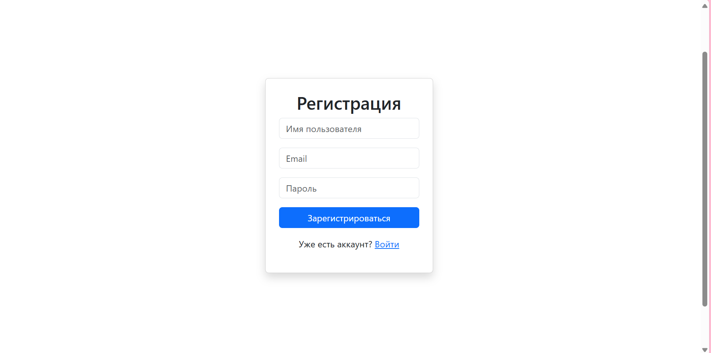
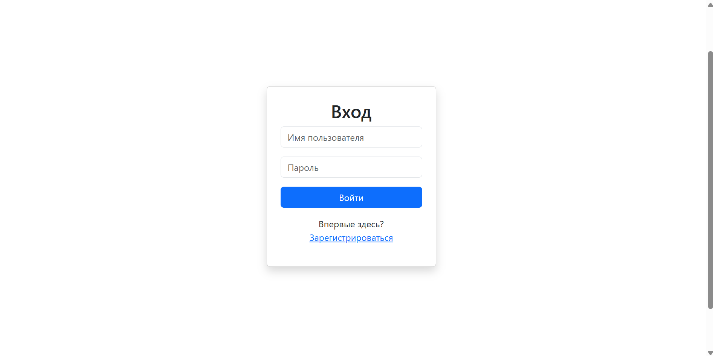
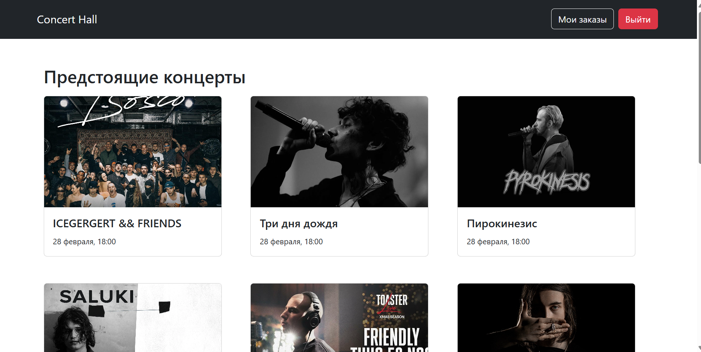
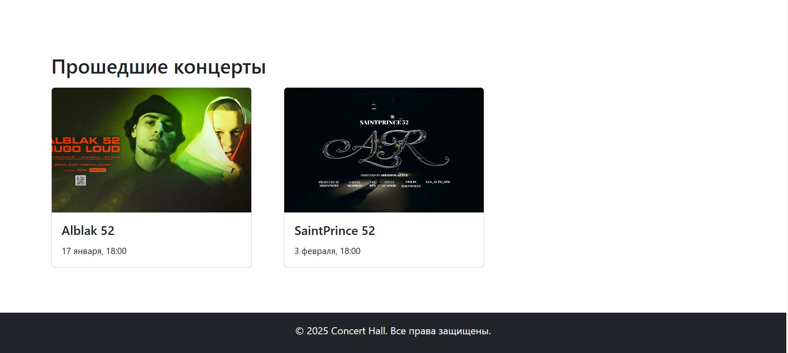
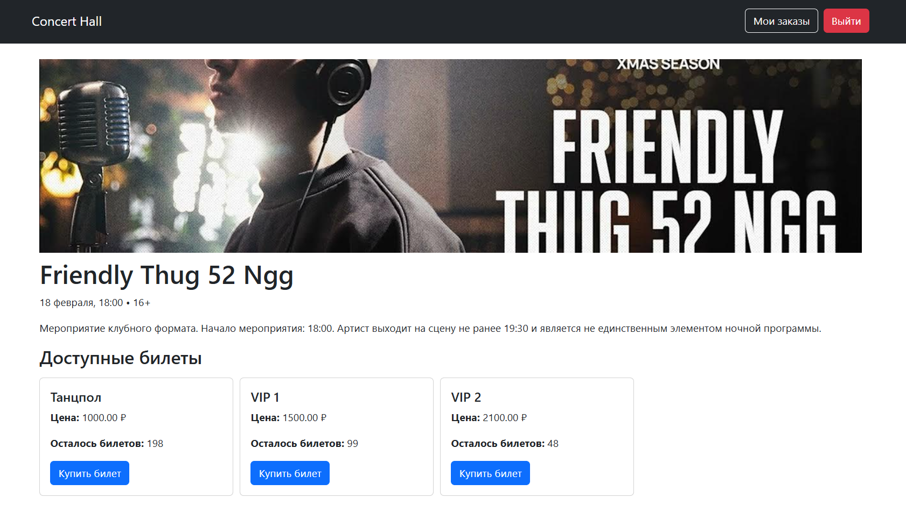
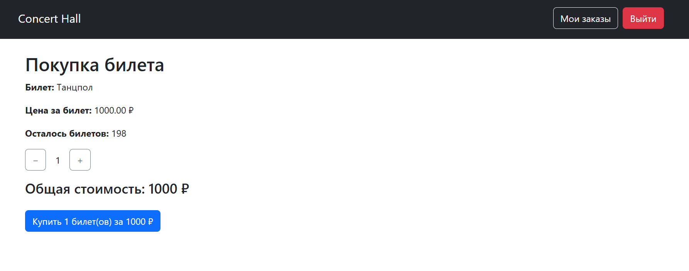
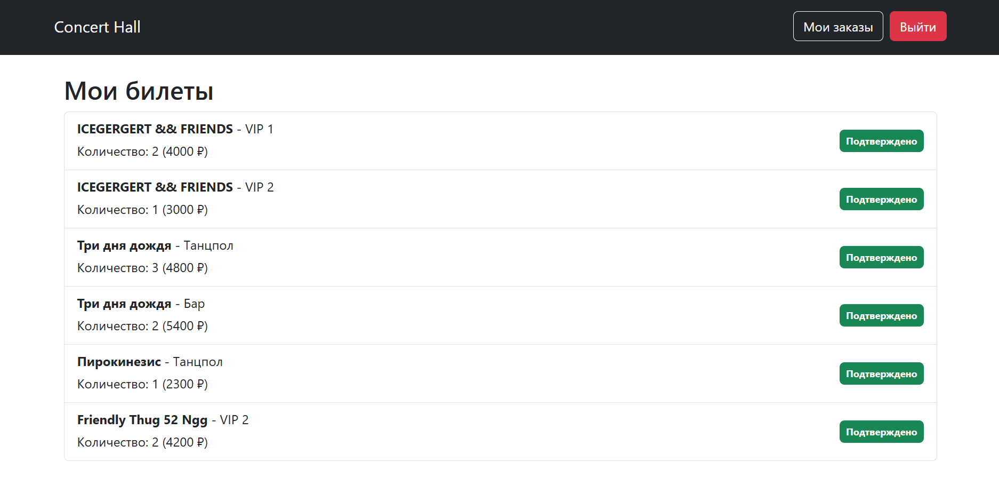
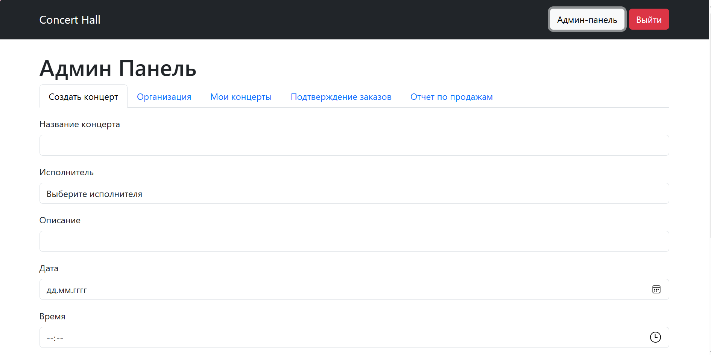

# Страницы

## Станица регистрации

```js
import React, { useState } from 'react';
import axios from 'axios';
import { useNavigate, Link } from 'react-router-dom';

const RegisterPage = () => {
  const [username, setUsername] = useState('');
  const [email, setEmail] = useState('');
  const [password, setPassword] = useState('');
  const [error, setError] = useState(null);
  const [success, setSuccess] = useState(null);
  const navigate = useNavigate();

  const handleSubmit = async (e) => {
    e.preventDefault();
    try {
      const response = await axios.post('http://localhost:8000/auth/register/', {
        username,
        email,
        password
      });
      setSuccess('Регистрация успешна! Теперь вы можете войти.');
      setError(null);
      setTimeout(() => navigate('/login'), 2000);
    } catch (err) {
      setError('Ошибка регистрации. Возможно, имя пользователя уже занято.');
      setSuccess(null);
    }
  };

  return (
    <div className="container d-flex justify-content-center align-items-center vh-100">
      <div className="card p-4 shadow" style={{ width: '300px' }}>
        <h2 className="text-center">Регистрация</h2>
        <form onSubmit={handleSubmit}>
          <div className="mb-3">
            <input className="form-control" type="text" placeholder="Имя пользователя" value={username} onChange={(e) => setUsername(e.target.value)} required />
          </div>
          <div className="mb-3">
            <input className="form-control" type="email" placeholder="Email" value={email} onChange={(e) => setEmail(e.target.value)} />
          </div>
          <div className="mb-3">
            <input className="form-control" type="password" placeholder="Пароль" value={password} onChange={(e) => setPassword(e.target.value)} required />
          </div>
          <button className="btn btn-primary w-100" type="submit">Зарегистрироваться</button>
        </form>
        {error && <p className="text-danger text-center mt-2">{error}</p>}
        {success && <p className="text-success text-center mt-2">{success}</p>}
        <p className="text-center mt-3">Уже есть аккаунт? <Link to="/login">Войти</Link></p>
      </div>
    </div>
  );
};

export default RegisterPage;

```



## Станица входа

```js
import React, { useState } from 'react';
import axios from 'axios';
import {Link, useNavigate} from "react-router-dom";

const LoginPage = () => {
  const [username, setUsername] = useState('');
  const [password, setPassword] = useState('');
  const [error, setError] = useState(null);
  const navigate = useNavigate();


  const handleSubmit = async (e) => {
    e.preventDefault();
    try {
      const response = await axios.post('http://localhost:8000/auth/login/', { username, password });
      const response2 = await axios.post('http://localhost:8000/auth/token/token/login', { username, password });
      localStorage.setItem('access_token', response.data.access);
      localStorage.setItem('refresh_token', response.data.refresh);
      localStorage.setItem('token', response2.data.auth_token)
      console.log(response2)
      setError(null);
      navigate("/");
    } catch (err) {
      setError('Неверное имя пользователя или пароль');
    }
  };

  return (
    <div className="container d-flex justify-content-center align-items-center vh-100">
      <div className="card p-4 shadow" style={{width: '300px'}}>
        <h2 className="text-center">Вход</h2>
        <form onSubmit={handleSubmit}>
          <div className="mb-3">
            <input className="form-control" type="text" placeholder="Имя пользователя" value={username}
                   onChange={(e) => setUsername(e.target.value)}/>
          </div>
          <div className="mb-3">
            <input className="form-control" type="password" placeholder="Пароль" value={password}
                   onChange={(e) => setPassword(e.target.value)}/>
          </div>
          <button className="btn btn-primary w-100" type="submit">Войти</button>
        </form>
        {error && <p className="text-danger text-center mt-2">{error}</p>}
        <p className="text-center mt-3">Впервые здесь? <Link to="/register">Зарегистрироваться</Link></p>
      </div>
    </div>
  );
};

export default LoginPage;
```




## Страница концертов

```js
import React, { useEffect, useState } from 'react';
import axios from 'axios';
import ConcertCard from '../components/ConcertCard';

const HomePage = () => {
  const [concerts, setConcerts] = useState([]);

  useEffect(() => {
    const fetchConcerts = async () => {
      try {
        const response = await axios.get('http://localhost:8000/concerts/');
        setConcerts(response.data);
      } catch (error) {
        console.error('Error fetching concerts', error);
      }
    };
    fetchConcerts();
  }, []);

  const upcomingConcerts = concerts.filter(concert => concert.status === 'prepared');
  const pastConcerts = concerts.filter(concert => concert.status === 'held');

  return (
    <div>
      <main className="container mt-4">
        <h2 className="mt-5 mb-3">Предстоящие концерты</h2>
        <div className="row gx-4 mt-2">
          {upcomingConcerts.map(concert => (
              <div className="col-md-4 col-sm-6 mb-4" key={concert.id}>
                <ConcertCard concert={concert}/>
              </div>
          ))}
        </div>

        <h2 className="mt-5 mb-3">Прошедшие концерты</h2>
        <div className="row gx-4 mt-2">
          {pastConcerts.map(concert => (
              <div className="col-md-4 col-sm-6 mb-4" key={concert.id}>
                <ConcertCard concert={concert}/>
              </div>
          ))}
        </div>
      </main>
    </div>
  );
};

export default HomePage;
```




## Страница концерта

```js
import React, { useEffect, useState } from 'react';
import { useParams } from 'react-router-dom';
import axios from 'axios';
import { formatInTimeZone } from 'date-fns-tz';
import { ru } from 'date-fns/locale';

const ConcertDetail = () => {
  const { id } = useParams();
  const [concert, setConcert] = useState(null);

  useEffect(() => {
    const fetchConcert = async () => {
      try {
        const response = await axios.get(`http://localhost:8000/concerts/${id}/`);
        setConcert(response.data);
      } catch (error) {
        console.error('Error fetching concert details', error);
      }
    };
    fetchConcert();
  }, [id]);

  if (!concert) return <div>Loading...</div>;

  const timeZone = 'Europe/Moscow';
  const dateObj = new Date(concert.date);
  const timeObj = new Date(`${concert.date}T${concert.time}`);
  const formattedDate = formatInTimeZone(dateObj, timeZone, "d MMMM", { locale: ru });
  const formattedTime = formatInTimeZone(timeObj, timeZone, "HH:mm", { locale: ru });
 console.log(concert.tickets)
  return (
    <div className="container mt-4">
      
      <h1 className="mt-2">{concert.title}</h1>
      <p>{formattedDate}, {formattedTime} • {concert.age_limit}+</p>
      <p>{concert.description}</p>

      {concert.status !== 'held' && (
        concert.tickets?.length > 0 ? (
            <div>
                <h3>Доступные билеты</h3>
                <div style={{overflowX: 'auto', whiteSpace: 'nowrap', paddingBottom: '10px'}}>
                    <div className="d-flex mt-2" style={{gap: '10px', flexWrap: 'nowrap'}}>
                        {concert.tickets.map(ticket => (
                            <div className="card" key={ticket.id} style={{width: '300px', flex: '0 0 auto'}}>
                                <div className="card-body">
                                    <h5 className="card-title">{ticket.name}</h5>
                                    <p className="card-text"><strong>Цена:</strong> {ticket.price} ₽</p>
                                    <p className="card-text"><strong>Осталось
                                        билетов:</strong> {ticket.available_quantity}</p>
                                    <a href={`/orders/${ticket.id}`} className="btn btn-primary">Купить билет</a>
                                </div>
                            </div>
                        ))}
                    </div>
                </div>
            </div>
        ) : (
            <p>Билеты недоступны для этого концерта.</p>
        )
      )}
    </div>
  );
};

export default ConcertDetail;

```



## Страница покупки билета

```js
import React, { useEffect, useState } from 'react';
import { useParams } from 'react-router-dom';
import axios from 'axios';
import { formatInTimeZone } from 'date-fns-tz';
import { ru } from 'date-fns/locale';

const ConcertDetail = () => {
  const { id } = useParams();
  const [concert, setConcert] = useState(null);

  useEffect(() => {
    const fetchConcert = async () => {
      try {
        const response = await axios.get(`http://localhost:8000/concerts/${id}/`);
        setConcert(response.data);
      } catch (error) {
        console.error('Error fetching concert details', error);
      }
    };
    fetchConcert();
  }, [id]);

  if (!concert) return <div>Loading...</div>;

  const timeZone = 'Europe/Moscow';
  const dateObj = new Date(concert.date);
  const timeObj = new Date(`${concert.date}T${concert.time}`);
  const formattedDate = formatInTimeZone(dateObj, timeZone, "d MMMM", { locale: ru });
  const formattedTime = formatInTimeZone(timeObj, timeZone, "HH:mm", { locale: ru });
 console.log(concert.tickets)
  return (
    <div className="container mt-4">
      
      <h1 className="mt-2">{concert.title}</h1>
      <p>{formattedDate}, {formattedTime} • {concert.age_limit}+</p>
      <p>{concert.description}</p>

      {concert.status !== 'held' && (
        concert.tickets?.length > 0 ? (
            <div>
                <h3>Доступные билеты</h3>
                <div style={{overflowX: 'auto', whiteSpace: 'nowrap', paddingBottom: '10px'}}>
                    <div className="d-flex mt-2" style={{gap: '10px', flexWrap: 'nowrap'}}>
                        {concert.tickets.map(ticket => (
                            <div className="card" key={ticket.id} style={{width: '300px', flex: '0 0 auto'}}>
                                <div className="card-body">
                                    <h5 className="card-title">{ticket.name}</h5>
                                    <p className="card-text"><strong>Цена:</strong> {ticket.price} ₽</p>
                                    <p className="card-text"><strong>Осталось
                                        билетов:</strong> {ticket.available_quantity}</p>
                                    <a href={`/orders/${ticket.id}`} className="btn btn-primary">Купить билет</a>
                                </div>
                            </div>
                        ))}
                    </div>
                </div>
            </div>
        ) : (
            <p>Билеты недоступны для этого концерта.</p>
        )
      )}
    </div>
  );
};

export default ConcertDetail;

```




## Страница заказов пользователя

```js
import React, { useEffect, useState } from "react";
import { useNavigate } from "react-router-dom";
import axios from "axios";

const statusColors = {
  confirmed: "bg-success",
  pending: "bg-warning",
  returned: "bg-danger"
};

const statusLabels = {
  confirmed: "Подтверждено",
  pending: "В ожидании",
  returned: "Возврат"
};

const UserProfile = () => {
  const [orders, setOrders] = useState([]);
  const navigate = useNavigate();

  useEffect(() => {
    const fetchOrders = async () => {
      try {
        const response = await axios.get("http://localhost:8000/orders/my/", {
          headers: { Authorization: `Token ${localStorage.getItem("token")}` },
        });
        setOrders(response.data);
      } catch (error) {
        console.error("Ошибка при загрузке заказов:", error);
      }
    };

    fetchOrders();
  }, []);

  return (
    <div className="container mt-4">
      <h2>Мои билеты</h2>
      {orders.length > 0 ? (
        <ul className="list-group mt-2">
          {orders.map(order => (
            <li
              key={order.id}
              className="list-group-item d-flex justify-content-between align-items-center"
              onClick={() => navigate(`/concerts/${order.concert.id}`)}
              style={{ cursor: "pointer" }}
            >
              <div>
                <p className="mb-1"><strong>{order.concert.title}</strong> - {order.ticket.name}</p>
                <p className="mb-1">Количество: {order.quantity} ({order.ticket.price * order.quantity} ₽)</p>
              </div>
              <span className={`badge ${statusColors[order.status]} text-white p-2`}>
                {statusLabels[order.status]}
              </span>
            </li>
          ))}
        </ul>
      ) : (
        <p>У вас пока нет заказов.</p>
      )}
    </div>
  );
};

export default UserProfile;

```




## Админ панель

```js
import React, { useState } from 'react';
import { Tab, Tabs } from 'react-bootstrap';
import CreateConcert from '../components/CreateConcert';
import Organization from '../components/Organization';
import MyConcerts from '../components/MyConcerts';
import OrderConfirmation from '../components/OrderConfirmation';
import SalesReport from '../components/SalesReport';

const AdminDashboard = () => {
  const [key, setKey] = useState('createConcert');

  return (
    <div>
      <h1>Админ Панель</h1>
      <Tabs activeKey={key} onSelect={(k) => setKey(k)} id="admin-tabs">
        <Tab eventKey="createConcert" title="Создать концерт">
          <CreateConcert />
        </Tab>
        <Tab eventKey="organization" title="Организация">
          <Organization />
        </Tab>
        <Tab eventKey="myConcerts" title="Мои концерты">
          <MyConcerts />
        </Tab>
        <Tab eventKey="orderConfirmation" title="Подтверждение заказов">
          <OrderConfirmation />
        </Tab>
        <Tab eventKey="salesReport" title="Отчет по продажам">
          <SalesReport />
        </Tab>
      </Tabs>
    </div>
  );
};

export default AdminDashboard;


```
